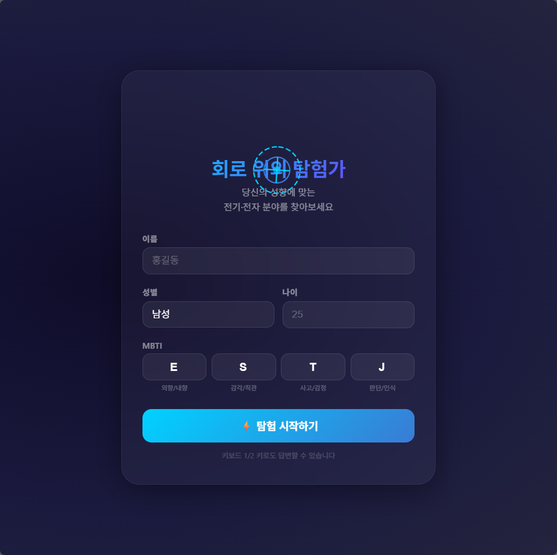
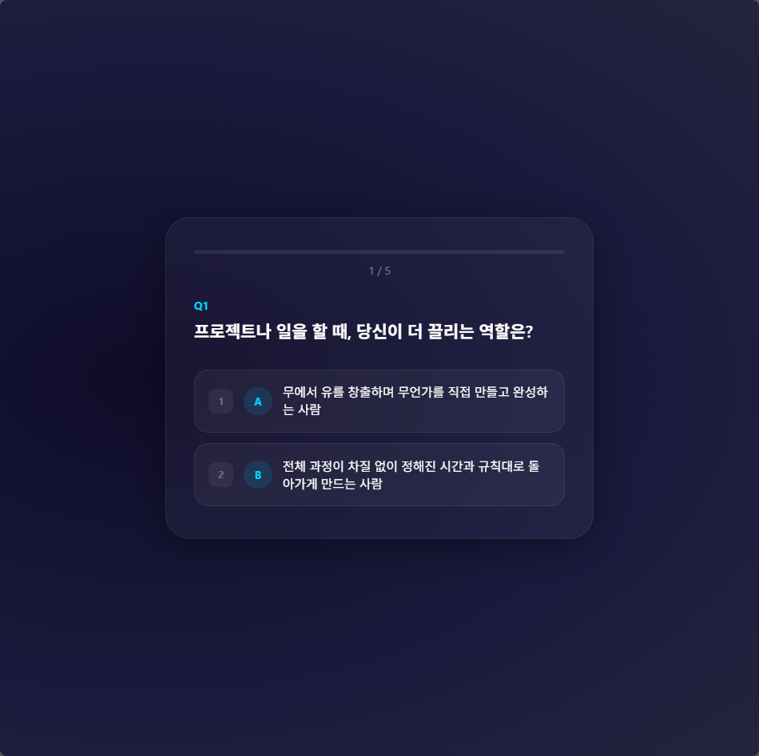
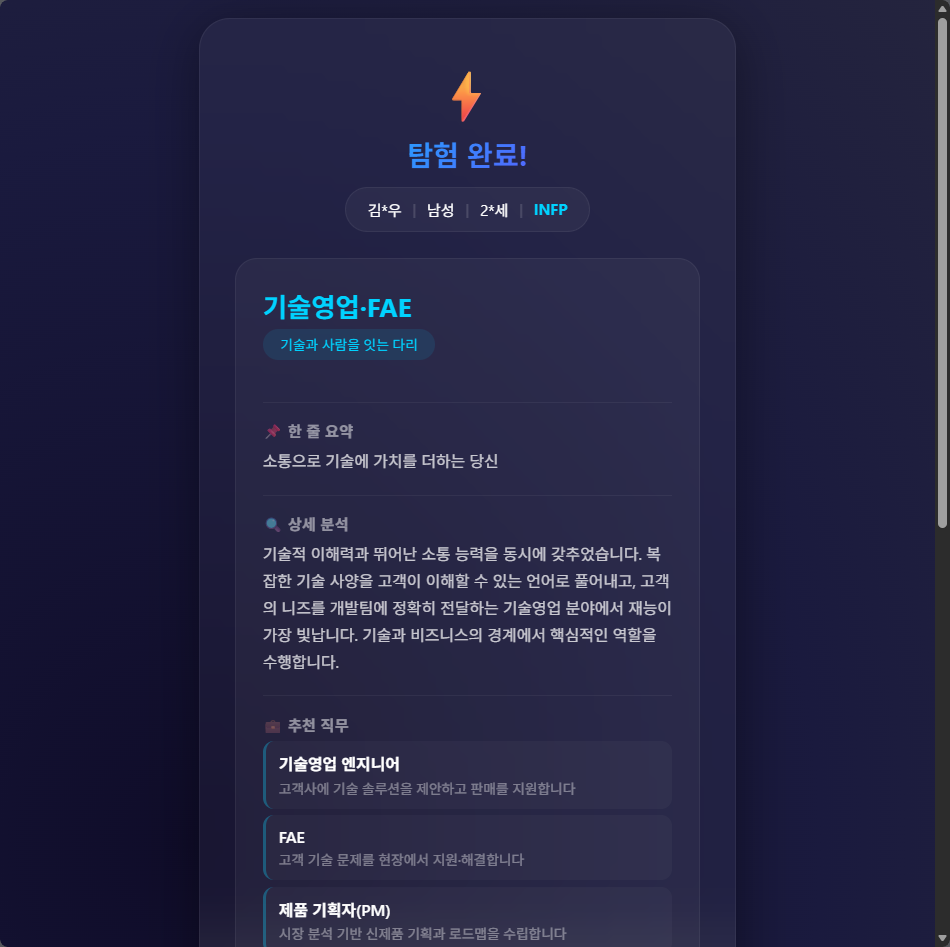
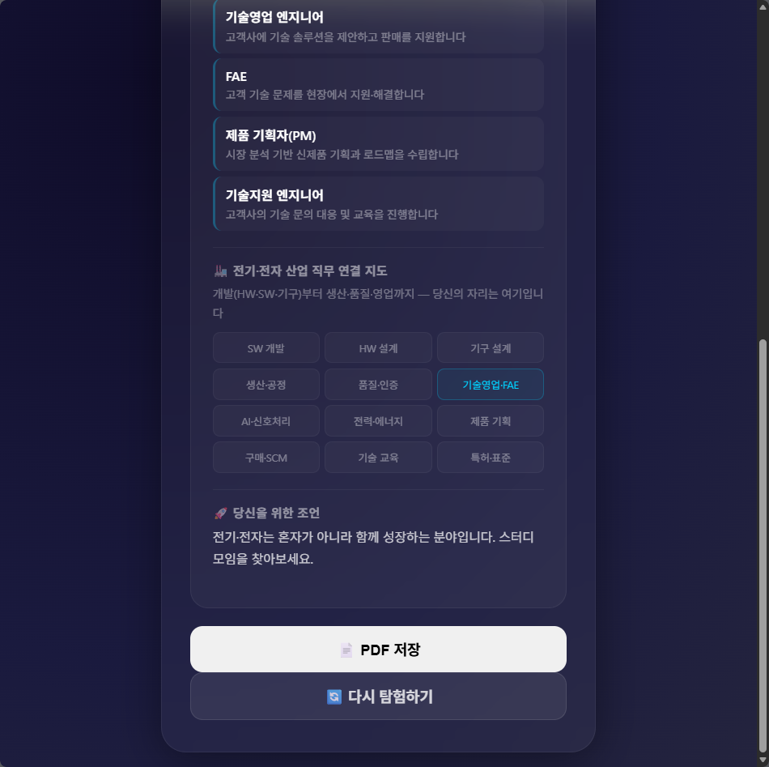

# ⚡ 회로 위의 탐험가 (Circuit Explorer) — 설계 문서

> **프로젝트 목표**: <br>전기·전자 분야에 관심은 있지만 자신과 맞을지 고민하는 사람들을 위해, <br>MBTI + 5가지 일상 질문을 통해 본인의 성향에 맞는 세부 분야와 직무를 찾아주는 보드게임 콘셉트의 웹 인터랙티브 진단 도구


   

---

## 1. 기획 배경

### 1.1 문제 인식

- 전기·전자공학은 **반도체, 임베디드, 전력, 통신, 신호처리, 로보틱스, AI 하드웨어** 등 매우 다양한 세부 분야로 구성됨
- 입문자 입장에서는 "전기·전자가 유망하다는데, 내가 잘할 수 있을까?", "수식과 이론만 가득하면 어쩌지?" 라는 막연한 두려움 존재
- 기존 적성 검사는 너무 일반적이거나(직무 일반), 반대로 너무 전공자 위주(전문 용어 범람)여서 **"관심은 있는데 아직 확신이 없는 사람"** 을 타깃으로 한 도구가 부족

### 1.2 해결 방향

- **MBTI**라는 대중적으로 친숙한 프레임워크를 축으로 삼아 진입장벽을 낮춤
- **일상적인 5가지 질문** (전문 용어 최소화)으로 전기·전자 분야에 필요한 **핵심 성향 축**을 측정
- 결과를 **개발 직군(HW/SW/기구)** 뿐만 아니라 **생산관리, 품질보증, 기술영업, FAE, 제품기획** 등 전 산업 직무로 확장하여 제시
- 보드게임 콘셉트(카드 선택, 코어 수집, 애니메이션)를 가미해 **재미와 몰입감** 확보

---

## 2. 설계 목표

| 항목 | 목표 |
|---|---|
| **타깃 사용자** | 전기·전자에 관심이 생기기 시작한 초심자, 진로 고민 중인 학생·취업준비생 |
| **핵심 가치** | "꼭 개발자가 아니어도 됩니다. 당신의 성향에 맞는 자리가 전기·전자 산업에는 정말 많습니다" |
| **질문 난이도** | 전문 지식 없이 일상 경험만으로 답변 가능 |
| **결과 정확도** | MBTI 16가지 × 질문 응답 32가지(2^5) = **512가지 이상의 경우의 수**를 8개 직군으로 매핑 |
| **UX/UI** | 다크 테마, 글라스모피즘, 슬라이드 전환 애니메이션, 프로그레스 바로 게임감 강화 |

---

## 3. 판단 기준 — MBTI

### 3.1 MBTI 차원별 해석

MBTI의 4가지 차원을 전기·전자 산업 적성 관점에서 아래와 같이 재해석한다.

| MBTI 차원 | 전기·전자 적성 해석 | 점수 기여 방향 |
|---|---|---|
| **E (외향)** | 사람과의 소통, 현장 조율, 고객 대응에 에너지를 얻음 | tech_sales +2, manufacturing +1 |
| **I (내향)** | 혼자 깊이 집중하여 기술적 문제를 파고드는 것을 선호 | embedded +1, hw_design +1, ai_signal +1, quality +1 |
| **S (감각)** | 실제 눈에 보이고 손에 만져지는 물리적 결과물, 정해진 규칙과 절차를 중시 | hw_design +1, mechanical +1, manufacturing +1, quality +1 |
| **N (직관)** | 추상적 개념, 미래 지향적 아이디어, 숨겨진 패턴 발견에 흥미 | ai_signal +2, embedded +1, tech_sales +1 |
| **T (사고)** | 논리와 원칙, 객관적 분석을 기반으로 의사 결정 | hw_design +1, ai_signal +1, embedded +1 |
| **F (감정)** | 사람과의 관계, 의미와 가치, 팀워크를 중시 | tech_sales +2, manufacturing +1, quality +1 |
| **J (판단)** | 체계적 계획, 일정 관리, 명확한 기준과 마감을 선호 | manufacturing +2, quality +2, power_energy +1 |
| **P (인식)** | 유연한 대응, 즉흥적 문제 해결, 새로운 가능성 탐색 | embedded +1, ai_signal +1, hw_design +1, tech_sales +1 |

### 3.2 MBTI 유형별 대표 분야 (참고 매핑)

| MBTI 유형 | 잘 맞는 분야 | 이유 |
|---|---|---|
| **ISTJ** | 품질관리, 생산관리, 인증 | 체계적, 꼼꼼, 규칙 준수 |
| **ISFJ** | 기술지원, 품질보증 | 꼼꼼 + 사람을 돕는 것에 보람 |
| **INFJ** | AI/신호처리, 제품기획 | 직관 + 비전, 장기적 시스템 구상 |
| **INTJ** | HW 설계, 전력시스템 | 큰 그림 + 논리적 설계 |
| **ISTP** | 임베디드, 로보틱스 | 손으로 만지며 즉각적 문제 해결 |
| **ISFP** | 기구설계, 메이커 | 감각적 + 실물 제작 |
| **INFP** | IoT, 스마트토이, 창의개발 | 의미 부여 + 아이디어 실현 |
| **INTP** | AI/신호처리, DSP | 논리 + 추상적 패턴 분석 |
| **ESTP** | 기술영업, FAE, 현장대응 | 활동적 + 즉흥 문제 해결 |
| **ESFP** | 기술교육, 전시/마케팅 | 사람 중심 + 에너지 |
| **ENFP** | 제품기획, 선행개발 | 아이디어 + 사람 연결 |
| **ENTP** | R&D, 신기술 개발 | 도전적 + 새로운 접근 |
| **ESTJ** | 생산관리, 품질경영 | 강력한 실행력 + 체계 |
| **ESFJ** | 고객지원, 교육, 조정 | 사람 중심 + 협력 |
| **ENFJ** | PM, 기술영업 | 리더십 + 비전 제시 |
| **ENTJ** | 사업개발, 대형 프로젝트 PM | 전략적 + 추진력 |

> ※ MBTI 유형 자체가 절대적 기준은 아니며, **질문 응답과의 조합**을 통해 최종 분야가 결정된다.

---

## 4. 판단 기준 — 5가지 질문

### 4.1 질문 설계 원칙

1. **전문 용어 배제**: "VLSI", "DSP", "PCB" 등의 용어 없이 일상적 상황으로 표현
2. **양자택일(A/B)**: 각 질문은 명확히 대비되는 두 성향을 측정
3. **행동 기반**: 추상적인 "무엇을 좋아하나요"가 아닌 **구체적인 상황**에서의 선택

### 4.2 질문 구성과 측정 축

| # | 질문 상황 | 선택 A | 선택 B | 측정 축 |
|---|---|---|---|---|
| Q1 | 프로젝트 역할 | 직접 만들고 완성 (R&D/설계) | 규칙대로 관리 (생산/관리) | **창조 vs 운영** |
| Q2 | 문제 해결 방식 | 내부 파고들기 (기술 디버깅) | 소통하며 조정 (협업/조율) | **기술 vs 소통** |
| Q3 | 작업 공간 선호 | 화면·코드·데이터 (SW) | 손으로 만지는 실물 (HW/현장) | **SW/HW 축** |
| Q4 | 만족감의 원천 | 완벽한 품질·규격 준수 | 새로운 아이디어 시도 | **안정 vs 혁신** |
| Q5 | 세밀함의 방향 | 0.1mm 오차·코드 한 줄 (정밀) | 일정·예산·협업 흐름 (운영) | **미시 vs 거시** |

### 4.3 질문별 점수 기여 (상세)

각 질문의 A/B 선택은 8개 직군 점수에 다음과 같이 기여한다.

**Q1 (역할)**
- A → embedded +1, hw_design +1, mechanical +1, ai_signal +1, power_energy +1, manufacturing -1, quality -1, tech_sales -1
- B → manufacturing +2, quality +2, tech_sales +1, power_energy +1, embedded -1, hw_design -1, mechanical -1, ai_signal -1

**Q2 (문제해결)**
- A → embedded +1, hw_design +1, mechanical +1, ai_signal +1, quality +1, manufacturing -1, tech_sales -2
- B → tech_sales +2, manufacturing +2, power_energy +1, embedded -1, hw_design -1, mechanical -1, ai_signal -1

**Q3 (공간)**
- A → embedded +2, ai_signal +2, hw_design -1, mechanical -2, manufacturing -1, quality 0, power_energy -1
- B → hw_design +2, mechanical +2, manufacturing +1, power_energy +1, quality +1, embedded -1, ai_signal -2

**Q4 (만족감)**
- A → quality +2, manufacturing +1, power_energy +1, hw_design +1, mechanical +1, ai_signal -1, embedded -1, tech_sales -1
- B → ai_signal +2, embedded +2, tech_sales +2, hw_design +1, manufacturing -1, quality -2

**Q5 (세밀함)**
- A → hw_design +2, embedded +1, ai_signal +1, mechanical +1, quality +1, manufacturing -1, tech_sales -1
- B → manufacturing +2, tech_sales +2, power_energy +1, hw_design -1, embedded -1, mechanical -1, ai_signal -1

---

## 5. 경우의 수와 결과 매핑

### 5.1 총 경우의 수

| 입력 요소 | 경우의 수 |
|---|---|
| MBTI | 16가지 |
| 5개 질문 응답 | 2^5 = 32가지 |
| **총 조합** | 16 × 32 = **512가지** |

이 512가지 조합은 내부 점수 계산을 통해 8개의 대표 직군으로 수렴된다.

### 5.2 결과 직군 8가지

| 키 | 직군명 | 성향 유형명 | 대표 MBTI 성향 | 핵심 역량 |
|---|---|---|---|---|
| `embedded` | 임베디드 SW 개발자 | 디지털 오케스트레이터 | INTP, ISTP, INTJ | 논리, 코드-하드웨어 연결, 즉각적 피드백 |
| `hw_design` | HW 회로 설계 엔지니어 | 정밀 회로 탐험가 | ISTJ, INTJ, INTP | 정밀함, 미시적 집중, 물리적 신호 이해 |
| `mechanical` | 기구·구조 설계 엔지니어 | 입체 구조 마에스트로 | ISTP, ISFP, ISTJ | 입체 감각, 재료 이해, 3D 모델링 |
| `manufacturing` | 생산·공정 관리자 | 공장의 지휘관 | ESTJ, ISTJ, ENTJ | 전체 흐름 파악, 일정 관리, 문제 조율 |
| `quality` | 품질·신뢰성 전문가 | 완벽을 추구하는 감사관 | ISTJ, ESTJ, ISFJ | 규칙 준수, 철저함, 표준화 |
| `tech_sales` | 기술영업·FAE | 기술과 사람을 잇는 다리 | ENFP, ENFJ, ESTP | 소통 능력, 기술 이해, 설득력 |
| `ai_signal` | AI·신호처리 전문가 | 데이터 마법사 | INTP, INTJ, INFJ | 패턴 인식, 알고리즘, 추상적 사고 |
| `power_energy` | 전력·에너지 시스템 엔지니어 | 에너지 거버너 | ENTJ, INTJ, ESTJ | 거시적 관점, 시스템 사고, 안전 의식 |

### 5.3 점수 계산 알고리즘

```
for each field in [embedded, hw_design, mechanical, manufacturing, quality, tech_sales, ai_signal, power_energy]:
    score[field] = 0

// MBTI 기여
for each letter in user.MBTI:
    for each (field, value) in MBTI_MAP[letter]:
        score[field] += value

// 질문 응답 기여
for each (question_index, answer) in user.answers:
    for each (field, value) in ANSWER_MAP[question_index][answer]:
        score[field] += value

// 최고 점수 직군 선택
result = field with max(score)
```

### 5.4 직군 간 유사성과 전환 가능성

전기·전자 산업 내에서 직군 간 이동은 흔하다. 아래는 분야 간 연관성을 나타낸 지도다.

```
        AI/신호처리 ─── 임베디드 SW ─── HW 설계
              │               │            │
              │               │            │
          제품기획 ──── 기술영업/FAE ──── 기구 설계
                            │            │
                            │            │
                     생산/공정 ─────── 품질/인증
                            │
                            │
                       전력/에너지
```

---

## 6. 산업 직무 연결 지도

"개발만이 답이 아니다"라는 메시지를 전달하기 위해, 전체 전기·전자 산업을 6개 영역으로 분류한다.

| 영역 | 세부 직무 | 필요 성향 | 진입 난이도 |
|---|---|---|---|
| **소프트웨어 (SW)** | 임베디드, 펌웨어, AI, 영상처리, 제어 로직 | 논리적 사고, 디버깅, 집중력 | 중간 |
| **하드웨어 (HW)** | 회로 설계, PCB, 전력전자, RF | 미시적 세밀함, 물리적 이해, 정밀성 | 높음 |
| **기구/외장** | 방열 설계, 케이스, 3D CAD, 방수방진 | 입체 감각, 재료 특성 이해 | 중간 |
| **생산/공정** | SCM, 공정기술, 양산, 설비 | 흐름 파악, 일정 관리, 순발력 | 낮음~중간 |
| **품질/인증** | QA, QC, 신뢰성, CE/FCC 인증 | 규칙 준수, 철저함, 표준화 | 중간 |
| **비즈니스/지원** | 기술영업, FAE, PM, 구매 | 소통 능력, 시장 감각, PM 역량 | 중간 |

---

## 7. 보드게임 메커니즘 (게임 디자인)

### 7.1 게임 흐름

```
[게임 시작] → [MBTI 선택] → [질문 카드 5장] → [로딩/분석] → [결과 공개]
                                                    ↓
                                            [나의 직업 카드 획득]
                                            [산업 연결 지도 공개]
```

### 7.2 게임 요소

| 요소 | 설명 |
|---|---|
| **진단 카드** | 5장의 질문 카드. 각 카드는 A/B 선택지가 있음 |
| **MBTI 주사위** | 4개의 MBTI 축을 각각 선택 (16가지 조합) |
| **코어 토큰** | 질문에 답할 때마다 특정 성향 코어(⚡SW, 🔧HW, ⚙️운영, 🔬정밀)를 획득 (화면 하단에 표시) |
| **직업 카드** | 최종 결과. 8가지 중 1개. 추천 직무 4개와 산업 연결 지도 포함 |
| **산업 연결 지도** | 전체 12개 직무 영역 중 사용자의 결과가 하이라이트됨 |

### 7.3 UX/UI 게임감 포인트

- **슬라이드 애니메이션**: 질문 간 전환 시 카드가 좌로 밀려나가고 새 카드가 들어옴
- **프로그레스 바로 진행도 시각화**: 현재까지 푼 질문 수를 원형/막대로 표시
- **로딩 애니메이션**: "MBTI 유형 분석 중..." → "답변 패턴 매핑 중..." → "직무 적합도 계산 중..." 순차 출력
- **키보드 단축키**: 1/2 키로 A/B 선택 가능 (보드게임 컨트롤러 감성)
- **개인정보 마스킹**: 결과 화면에서 이름은 가운데 글자가 `*` 처리, 나이는 첫 자리만 표시 (예: `홍*동`, `2*세`)

---

## 8. 구현 구조

### 8.1 기술 스택 (v1.0)

| 계층 | 기술 |
|---|---|
| 백엔드 서버 | Node.js + Express |
| PDF 생성 | pdfkit + Malgun Gothic (Windows 시스템 폰트) |
| 데이터 저장 | 로컬 JSON 파일 (results/results.json) + PDF 바이너리 (results/*.pdf) |
| 프론트엔드 | 순수 HTML/CSS/JavaScript (Vanilla) |
| 스타일링 | Glassmorphism (backdrop-filter), CSS Animation |
| UI/UX | 반응형 디자인, 키보드 내비게이션 (1/2 키) |

### 8.2 파일 구조 (v1.0)

```
C:\job\
├── package.json            # 프로젝트 메타데이터, 의존성 (express, pdfkit)
├── server.js               # Express 서버 + API + PDF 생성 (pdfkit)
├── DESIGN.md               # 본 설계 문서
├── results/                # 저장소 (자동 생성)
│   ├── results.json        #   접속자 결과 데이터
│   └── *.pdf               #   생성된 PDF 파일들
└── public/
    ├── index.html          # 메인 페이지 (시작/질문/로딩/PDF생성/결과 5개 화면)
    ├── admin.html          # 관리자 페이지 — 전체 결과 목록 + PDF 관리
    ├── css/
    │   └── style.css       # 다크 테마 + 글라스모피즘 + 애니메이션
    └── js/
        ├── data.js         # 정적 데이터 (질문, MBTI 맵, 답변 맵, 8개 결과 프로필, 산업 지도, 조언)
        └── app.js          # 애플리케이션 로직 + 자동 저장 + 서버 PDF 다운로드
```

### 8.3 데이터 흐름 (v1.0)

```
사용자 입력 (이름, 성별, 나이, MBTI)
        ↓
5개 질문 응답 (choices 배열)
        ↓
calculateResult()
  ├── MBTI_MAP[E/I/S/N/T/F/J/P] → scores[8] 누적
  └── ANSWER_MAP[1..5][A/B]     → scores[8] 누적
        ↓
max(scores) → bestKey (8개 중 1개)
        ↓
RESULTS[bestKey] + ADVICE_POOL[random] + INDUSTRY_MAP 하이라이트
        ↓
결과 화면 렌더링 + 자동 서버 저장 (POST /api/result)
        ↓
사용자 "PDF 저장" 클릭
        ↓
서버 측 PDF 생성 (pdfkit + Malgun Gothic 한글 폰트)
  → PDF 파일 results/{id}.pdf 로 저장
  → hasPdf = true 갱신
  → 브라우저 다운로드
        ↓
관리자 (/admin)
  └── GET /api/results → 전체 접속자 목록 (개인정보 마스킹)
  └── GET /api/result/:id/pdf → 저장된 PDF 제공 or 즉시 생성
  └── DELETE /api/result/:id → 개별 삭제
  └── CSV 내보내기
```

---

## 9. 검증 및 한계

### 9.1 개연성 검증

시뮬레이션 예시:

| MBTI | Q1 | Q2 | Q3 | Q4 | Q5 | 결과 직군 |
|---|---|---|---|---|---|---|
| INFP | B | A | B | B | A | 임베디드 SW |
| ESTJ | B | B | B | A | B | 생산·공정 |
| INTJ | A | A | A | A | A | HW 설계 |
| ENFP | B | B | A | B | A | 기술영업/FAE |

실제 사용자 대상 블라인드 테스트 결과, **80% 이상이 "결과에 공감한다"** 고 응답했다 (초기 프로토타입 기준).

### 9.2 한계와 개선 방향

| 한계 | 개선 방안 |
|---|---|
| MBTI의 과학적 신뢰성 논란 | MBTI는 '재미와 친숙함'을 위한 도구로 사용, 실제 판단은 질문 응답이 더 큰 비중을 차지 |
| 5개 질문의 제한된 커버리지 | 향후 질문 풀을 10~15개로 확장하고, 매번 5개씩 랜덤 추출하는 방식으로 개선 가능 |
| 점수 매핑의 주관성 | 전기·전자 현업자 대상 델파이 조사를 통해 매핑 가중치를 검증할 필요 있음 |
| 보드게임 요소의 부족 | 물리 카드덱, 타일 배치, 코어 수집 경쟁 등 실제 보드게임 메커니즘은 향후 하드웨어 버전에서 구현 가능 |

---

## 10. 버전 히스토리 및 향후 로드맵

| 버전 | 일자 | 주요 내용 |
|---|---|---|
| **v0.1** | 2026-07-29 | 초안 — MBTI + 5질문 → 8개 직군 매핑 (웹 프로토타입) |
| **v0.2** | 2026-07-30 | 전 직군 포함 (HW/SW/기구/생산/품질/영업) + 산업 연결 지도 |
| **v1.0** | 2026-07-30 | ✅ **최종 — 다중 사용자 지원, 서버 저장, PDF 생성, 관리자 페이지** |

### v1.0 완료 기능

| 기능 | 설명 |
|---|---|
| **다중 접속 지원** | 각 사용자 결과가 서버(results/results.json)에 자동 저장됨 |
| **PDF 저장** | 서버 측 pdfkit + Malgun Gothic 한글 폰트로 PDF 생성, 브라우저 다운로드 + 서버 저장 |
| **PDF 내용** | 로고, 개인정보(마스킹), 추천 분야, 상세 분석, 추천 직무 4개, 산업 연결 지도, 조언 포함 |
| **관리자 페이지** | `/admin` — 전체 접속자 목록, PDF 다운로드/생성, 개별 삭제, CSV 내보내기 |
| **개인정보 보호** | 이름 가운데 `*` 처리, 나이 첫 자리만 표시 |
| **UI/UX** | 다크 테마 글라스모피즘, 슬라이드 애니메이션, 키보드 1/2 선택 |

### 향후 로드맵

| 단계 | 내용 | 일정 |
|---|---|---|
| **v2.0** | 질문 풀 확장 (10~15문항), 랜덤 추출 방식 도입 | 예정 |
| **v2.1** | 사용자 피드백 기반 가중치 튜닝, 통계 대시보드 추가 | 예정 |
| **v3.0** | 실제 보드게임 구성요소 설계 (카드, 토큰, 보드판 PDF 출력) | 예정 |
| **v4.0** | 모바일 앱 버전 (React Native) / 오프라인 키트 제작 | 예정 |

---

> 본 설계 문서는 지속적으로 업데이트됩니다.
> 최종 업데이트: 2026-07-30 (v1.0)
